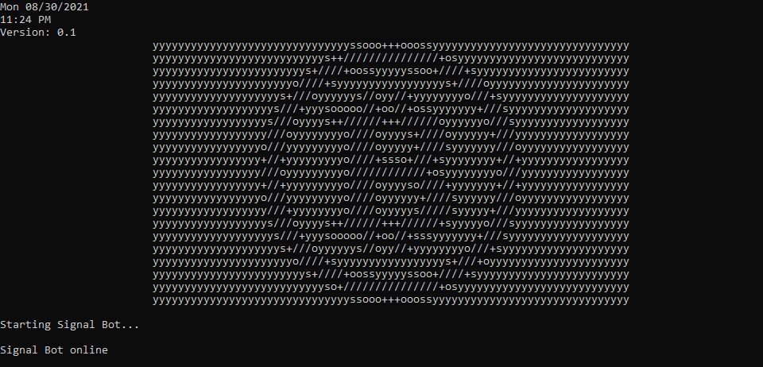

# SignalBot

Takes unofficial API wrapper data from TradingView and checks for TA targets from custom indicator data conditions.
 
No API signups or external API access key required!

</img>

## Utilities: 

- Getting notified via SMS when TA and price targets are met.
- Checking whether or not a predetermined target has been met.
- Find the best percentage of profit left until a predetermined price target is met.
- Checking for when a few technical analysis targets have been met to find potentially good entry and exit points of market positions.
 
This can also be modified to send you email alerts. 

The only things needed to be notified of targets triggering is a phone number and a Gmail account. 

(NOTE : You must turn ON "less secure app access" in security settings of your Gmail account).

See sms_auth.py to configure.

## Limitations

Due to the limitations of the wrapper data it does not generate real-time price data. However, through a lot of experimenting I found that on average the price data gets updated about every 27 seconds. A solution to this limitation can be found by introducing a custom actuation range for each TA target so that it is not vulnerable to faster moving price action while being limited to a ~27 second interval. This means you can get frequent enough price data updates and a custom actuation range which is large enough for the price to be in it for at least 27 seconds. The tradeoff to this is having to finetune the most optimal range for each asset where the user doesn't get early, late, or too many signals. 

## Disclaimer

It goes without saying that this code is not perfect and can give false positives in the right conditions of a market and the code should not be solely used as a deterministic indicator. It is not recommended to automate these indicators to trade in live markets either as that is highly risky.
It should also be noted I or any contributors of this project are not responsible for any financial decisions or financial losses that may be incurred as a result of using this project. 

 
The assets and targets predefined are arbitrary and can be replaced to anyone's liking which means the appropriate price data and optional sms alerts will also need to be replaced. The default ones are near my personal targets to suit my own needs. Of course, this code can be improved with the modular capabilities where any asset can be entered as an input but that was beyond the scope of my needs for this personal project. 

Although any improvements are welcome!

## External imports needed:
- tradingview_ta
- asyncio
- aiosmtplib
- typing

### How to install on Windows with Python 3
Open Command Prompt: 
``
py -m pip install tradingview_ta
``

This was made possible by: https://github.com/brian-the-dev/python-tradingview-ta
